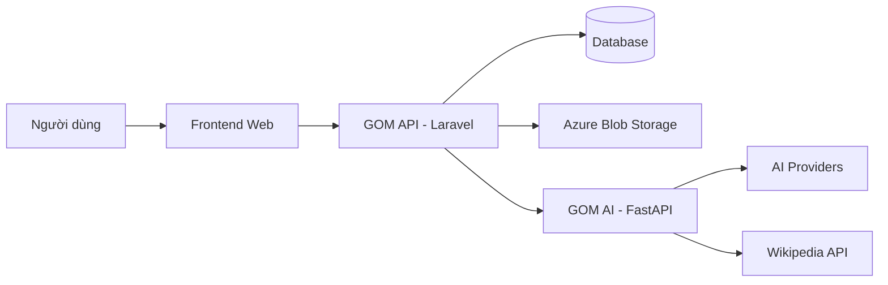
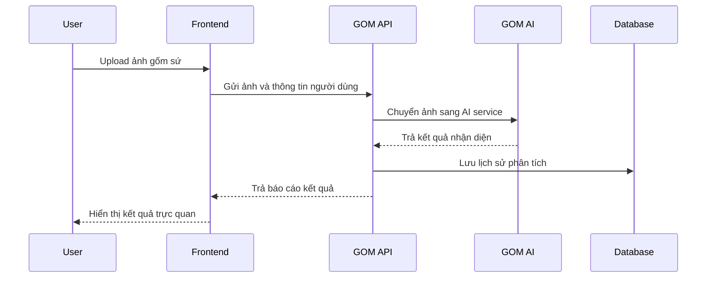

# 🏺 GOM - AI Ceramic Identification Platform

  <strong>Nền tảng nhận diện và tra cứu gốm sứ bằng trí tuệ nhân tạo</strong>

  GOM giúp người dùng upload ảnh hiện vật gốm sứ, nhận phân tích AI về dòng gốm, xuất xứ, niên đại và lưu lại lịch sử nhận diện một cách trực quan.

  &nbsp;&nbsp;
  &nbsp;&nbsp;
  &nbsp;&nbsp;
  

---

## 📌 Giới thiệu dự án

**GOM** là một hệ thống web ứng dụng trí tuệ nhân tạo để hỗ trợ nhận diện và tra cứu thông tin gốm sứ thông qua hình ảnh. Người dùng có thể upload ảnh hiện vật, sau đó hệ thống sẽ phân tích đặc điểm thị giác và đưa ra kết quả dự đoán về dòng gốm, xuất xứ, niên đại, độ tin cậy và phần giải thích đi kèm.

Dự án hướng đến việc giúp quá trình tìm hiểu gốm sứ trở nên nhanh hơn, trực quan hơn và dễ tiếp cận hơn cho người sưu tầm, sinh viên, giảng viên, người yêu văn hóa - lịch sử và các đối tượng có nhu cầu tham khảo thông tin hiện vật.

---

## 🎯 Mục tiêu dự án

| Mục tiêu | Mô tả |
|---|---|
| Ứng dụng AI vào nhận diện gốm sứ | Hỗ trợ người dùng phân tích ảnh hiện vật và nhận kết quả gợi ý ban đầu. |
| Tạo trải nghiệm tra cứu trực quan | Cho phép người dùng xem thông tin dòng gốm, niên đại, xuất xứ và đặc điểm nhận diện. |
| Lưu trữ lịch sử phân tích | Giúp người dùng quản lý và xem lại các kết quả đã phân tích trước đó. |
| Hỗ trợ hỏi đáp kiến thức | Tích hợp AI chatbot để giải đáp câu hỏi liên quan đến gốm sứ. |
| Dễ mở rộng hệ thống | Tách riêng backend chính và AI service để thuận tiện nâng cấp, bảo trì và triển khai. |

---

## ✨ Tính năng chính

| Nhóm tính năng | Chức năng nổi bật |
|---|---|
| Tài khoản người dùng | Đăng ký, đăng nhập, đăng nhập Google, cập nhật hồ sơ và đổi mật khẩu. |
| Nhận diện gốm qua ảnh | Upload ảnh gốm sứ và nhận báo cáo phân tích từ AI. |
| Báo cáo kết quả AI | Hiển thị dòng gốm dự đoán, xuất xứ, niên đại, độ tin cậy và lập luận nhận diện. |
| Lịch sử phân tích | Lưu lại các lần nhận diện để người dùng có thể xem lại khi cần. |
| AI Chatbot | Hỏi đáp kiến thức về gốm sứ, phong cách, lịch sử và đặc điểm nhận diện. |
| Thư viện dòng gốm | Hiển thị danh sách các dòng gốm tiêu biểu và thông tin tham khảo. |
| Token & lượt sử dụng | Quản lý lượt miễn phí, số dư token và lịch sử sử dụng dịch vụ AI. |
| Thanh toán | Cho phép người dùng mua thêm gói token để tiếp tục sử dụng chức năng AI. |
| Admin Dashboard | Quản lý người dùng, dòng gốm, lịch sử phân tích và thanh toán. |

---

## 🛠️ Công nghệ sử dụng

### Frontend

| Công nghệ | Vai trò |
|---|---|
| React / Next.js | Xây dựng giao diện web hiện đại, tối ưu trải nghiệm người dùng. |
| TypeScript | Tăng tính rõ ràng, an toàn và dễ bảo trì cho mã nguồn frontend. |
| Tailwind CSS | Thiết kế giao diện nhanh, responsive và đồng nhất. |
| Axios / Fetch API | Giao tiếp với backend thông qua REST API. |
| Google OAuth | Hỗ trợ đăng nhập bằng tài khoản Google. |

### Backend chính - GOM API

| Công nghệ | Vai trò |
|---|---|
| PHP / Laravel | Xử lý nghiệp vụ chính của hệ thống. |
| Laravel Sanctum | Xác thực người dùng bằng Bearer Token. |
| MySQL / SQLite | Lưu trữ người dùng, lịch sử phân tích, token và thanh toán. |
| Eloquent ORM | Làm việc với database theo mô hình ORM. |
| Azure Blob Storage | Lưu trữ ảnh người dùng upload. |

### Backend AI - GOM AI

| Công nghệ | Vai trò |
|---|---|
| Python | Ngôn ngữ chính cho AI service. |
| FastAPI | Xây dựng API xử lý AI nhanh và gọn nhẹ. |
| OpenAI / Gemini / Grok / Groq | Hỗ trợ phân tích hình ảnh, đưa ra dự đoán và tổng hợp kết quả. |
| Wikipedia API | Bổ sung nguồn kiến thức tham khảo cho chức năng hỏi đáp. |

### Deployment & Infrastructure

| Công nghệ | Vai trò |
|---|---|
| Azure App Service | Triển khai backend API và AI service. |
| Azure Blob Storage | Lưu trữ file ảnh trên cloud. |
| Vercel | Triển khai frontend. |
| GitHub Actions | Hỗ trợ CI/CD. |
| Nginx | Cấu hình phục vụ ứng dụng hoặc reverse proxy khi triển khai. |

---

## 🧩 Kiến trúc tổng quan

| Thành phần | Vai trò |
|---|---|
| **Frontend Web** | Cung cấp giao diện cho người dùng upload ảnh, xem kết quả, tra cứu thông tin và quản lý tài khoản. |
| **GOM API** | Quản lý người dùng, xác thực, token, thanh toán, lịch sử phân tích, dòng gốm và admin dashboard. |
| **GOM AI** | Xử lý ảnh, phân tích bằng AI và trả về báo cáo nhận diện cho backend chính. |
| **Database** | Lưu dữ liệu người dùng, lịch sử nhận diện, thanh toán và thông tin dòng gốm. |
| **Azure Blob Storage** | Lưu trữ ảnh upload và tài nguyên hình ảnh của hệ thống. |

---

## 🔄 Luồng sử dụng cơ bản

---

## 👥 Đối tượng người dùng

| Nhóm người dùng | Nhu cầu chính |
|---|---|
| Người sưu tầm gốm | Nhận diện nhanh hiện vật và lưu lại kết quả phân tích. |
| Sinh viên / giảng viên | Tham khảo thông tin phục vụ học tập, nghiên cứu mỹ thuật, lịch sử hoặc khảo cổ. |
| Người yêu văn hóa - lịch sử | Tìm hiểu nguồn gốc, phong cách và niên đại của gốm sứ. |
| Quản trị viên | Quản lý người dùng, dòng gốm, thanh toán và dữ liệu hệ thống. |

---

## ⭐ Điểm nổi bật

- **Nhận diện qua hình ảnh:** người dùng chỉ cần upload ảnh hiện vật để nhận kết quả phân tích ban đầu.
- **AI multi-agent:** hệ thống có thể khai thác nhiều AI providers để hỗ trợ phân tích và tổng hợp kết quả.
- **Báo cáo dễ hiểu:** kết quả gồm dự đoán, xuất xứ, niên đại, độ tin cậy và phần giải thích.
- **Có lịch sử phân tích:** người dùng có thể xem lại các kết quả đã thực hiện.
- **Có chatbot hỗ trợ:** giúp người dùng hỏi thêm về đặc điểm, phong cách và kiến thức gốm sứ.
- **Kiến trúc dễ mở rộng:** tách riêng web backend và AI backend để thuận tiện phát triển về sau.

---

## 🚀 Hướng phát triển tương lai

| Hướng phát triển | Mô tả |
|---|---|
| Mở rộng thư viện gốm | Bổ sung thêm nhiều dòng gốm, quốc gia, phong cách và thời kỳ lịch sử. |
| Nâng cấp dashboard | Thêm biểu đồ thống kê, hành vi sử dụng và hiệu suất hệ thống. |
| Hỗ trợ đa ngôn ngữ | Bổ sung tiếng Anh hoặc các ngôn ngữ khác cho người dùng quốc tế. |
| Tối ưu AI | Cải thiện độ chính xác bằng dữ liệu chuyên ngành và phản hồi từ người dùng. |
| Gợi ý tài liệu tham khảo | Đề xuất nguồn thông tin phù hợp với kết quả nhận diện. |

---

## 📎 Kết luận

**GOM** là dự án kết hợp giữa công nghệ web, trí tuệ nhân tạo và tri thức văn hóa - lịch sử. Hệ thống hỗ trợ người dùng nhận diện gốm sứ nhanh hơn, lưu lại kết quả phân tích và tiếp cận kiến thức hiện vật theo cách hiện đại, trực quan và dễ sử dụng.
